AI Engineer at a semiconductor company by day, indie hacker by night. Building AI systems and developer tools. 8+ years of turning manufacturing data into something useful.

*If I have to do it twice, I automate it.*

<table width="960px">
<tr>
<td width="480px" valign="top">

**Latest Releases**

<!-- releases starts -->
• [ghost-mcp v1.3.0](https://github.com/uppinote20/ghost-mcp/releases/tag/v1.3.0) - 2026-05-31 
• [claude-dashboard v1.29.0](https://github.com/uppinote20/claude-dashboard/releases/tag/v1.29.0) - 2026-05-30 
• [obsidian-auto-note-importer 1.0.1](https://github.com/uppinote20/obsidian-auto-note-importer/releases/tag/1.0.1) - 2026-05-29 
• [duru v0.5.0](https://github.com/uppinote20/duru/releases/tag/v0.5.0) - 2026-05-20
<!-- releases ends -->

</td>
<td width="480px" valign="top">

**Recent Posts**

<!-- blog starts -->
• [OAuth와 이메일 가입을 하나의 온보딩 ..](https://uppinote.dev/blog/unified-onboarding-oauth-email-signup/) - 2026-06-05 
• [NextAuth v5 JWT 콜백: OAu..](https://uppinote.dev/blog/nextauth-v5-jwt-callback-oauth-credentials-branching/) - 2026-06-04 
• [NextAuth PrismaAdapter ..](https://uppinote.dev/blog/nextauth-prisma-adapter-encrypted-email-blind-index/) - 2026-06-03 
• [OG 이미지 구현의 두 전환점: 단순한 답..](https://uppinote.dev/blog/og-image-refactored-twice-simpler-design-wins/) - 2026-06-02 
• [Next.js i18n 미들웨어에서 OG ..](https://uppinote.dev/blog/nextjs-i18n-og-image-middleware-rewrite-redirect/) - 2026-06-01 
• [Next.js opengraph-image..](https://uppinote.dev/blog/nextjs-satori-opengraph-korean-font-loading/) - 2026-05-29
<!-- blog ends -->

</td>
</tr>
</table>

  
  

  

